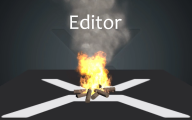
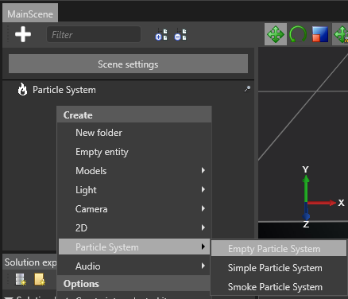
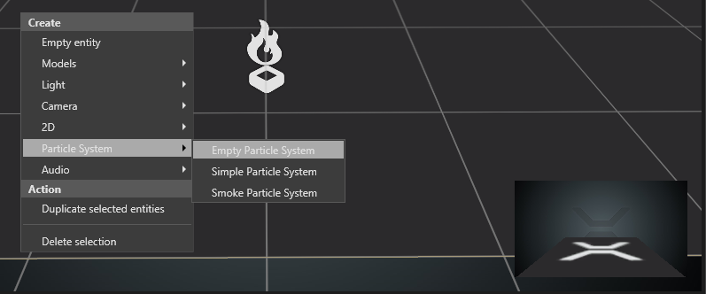

# Editing Particle Effects

 

This document assumes you are already familiar with the [Terminology](../particles-reference-terminology/index.md) regarding particles.

## Creating Particle Systems

Particles can be created directly in the game studio by using the scene and the property grid windows.

 

You can create a new entity which contains a particle system component by right-clicking on the scene tree and choosing a particle system type of entity. There are several presets to help you get started.

The icon for an entity containing a particle system component is a small flame.

 

Alternatively you can create the entity directly in the scene viewport by right-clicking at the location you want to place it. The gizmo icon for an entity containing a particle system component is a flame in a box stand.

If you create an empty particle system it won't have any particles so you won't see anything but the icon. We suggest trying the preset systems first.

## Editing a Particle System

You can select an entity containing a particle system component and edit it using the Property Grid just like any other entity in the game studio.

 

An entity requires the Transform component and the particle system component to contain a particle system. You can add a particle system component to any entity which doesn't have one already. If you want two particle systems to share the same transformation you can create two entities and add one of them as a child to the other.

### Transform Component

The transform component provides a locator for the particle system. Think of it as the node in the scene where you attach the particle system. Some elements in the particle system may choose to ignore one or more locator elements, for example rotation or scaling. For example the gravity force should not depend on the rotation of the particle system and always ignores rotation, but a fountain particle system inherits the location for the purposes of initial particle velocity. For scaling, only uniform scaling is supported. If you have a non-uniform scale on the transform component, only the X axis will be used.

### Editor Control

The editor control provides control for authoring particles which are only used when in the game studio. These properties have no effect on the particle system when you play it in your game. There are simple controls for playing, pausing and stopping a particle system, as well as resetting the simulation every few seconds to allow one-shot effects to be repeatedly played.

### Source

Contrary to the exposed values, the source is the low-level implementation of the particle effect itself. It is reserved for the author of the effect and not the user.

*Note! The source of the particle effect is currently in-lined in the component but will potentially move to dedicated asset in the future.*

#### Warm-up time

When you first play the particle effect it will appear already running if you set this value to greater than 0. The units are in seconds, so if you set 1 as warm-up time the particle effect will appear as if it has already been active for 1 second.

#### Bounding Shape

Contains a user-defined shape used by the engine for culling and optimizations.

#### Emitters

The list of the [Emitters](../particles-reference-emitters/index.md) contained by the particle system. They are updated and drawn in the order they appear on the list and can be reordered.

#### Exposed values

Exposed values are properties of the particle effect exposed to the user. When anybody but the particle effect author want to use the particle system in a game, ideally they should only control the entity components and the exposed values directly and not the source.

There are two exposed values Color Shade, which controls the shade of the entire particle effect, and Speed Scale, which controls the simulation speed for the entire particle effect.

*Note! These two properties are likely to be merged in a user-customizable property list in the future.*

