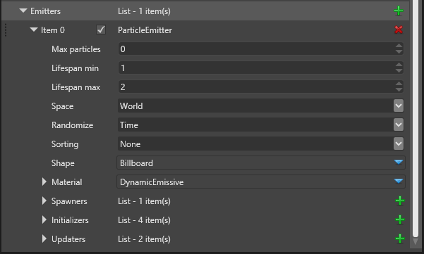

# Particle Emitters

 

A particle emitter is a sub-container in the particle system, which is responsible for one single visual aspect of the entire effect. For instance, a fire effect would have flames, embers and smoke, and each of them will be managed by a separate Particle Emitter, so we will have three emitters in total. The Particle Emitter manages how many particles there are, how they appear, move and disappear, and how they are drawn.

Emitters are contained in a list and they are updated and drawn in the order in which they appear on the list. You can easily control them by reordering the list.

 

| Property         | Description                                                                                            |
|------------------|--------------------------------------------------------------------------------------------------------|
| Max Particles    | Every emitter can hold a maximum number of particles based on their spawn rate and lifetime.           |
|                  | By leaving this value 0 you can let the engine pick its own estimate which is often good.              |
|                  | By setting the value to a positive number you can limit the maximum number of living particles         |
|                  | this emitter can have at any given time.                                                               |
|                  |                                                                                                        |
| Lifespan min     | When a new particle is spawned it will start with at least that much remaining life.                   |
| Lifespan max     | When a new particle is spawned it will start with at most that much remaining life.                    |
|                  |                                                                                                        |
| Space            | Particles in World space are spawned from the emitter, but remain in the world space when the          |
|                  | emitter moves away. Particles in Local space always exist in the emitter's local coordinate system     |
|                  | and if the emitter moves, rotates or scales, they move together. A particle cannot be both spawned     |
|                  | in World and in Local space!                                                                           |
|                  |                                                                                                        |
| Randomize        | Particles use pseudo-random values for everything which simulates randomness. If you leave this        |
|                  | attribute to Time all emitters will generally generate different random numbers. If you set it to      |
|                  | Fixed, two different instances of the same effect will behave the exact same way.                      |
|                  | Lastly, Position acts as Fixed but is different for different positions.                               |
|                  |                                                                                                        |
| Sorting          | Additive particles don't need sorting and this is the default value.                                   |
|                  | Other possibilities is to sort the particles by depth (away from the camera) or by age, in which       |
|                  | case particles spawned first will be drawn on top.                                                     |
|                  |                                                                                                        |
| Shape            | What [Shape](../particles-reference-shapebuilders/index.md) should be used for drawing the particles.  |
|                  |                                                                                                        |
| Material         | What [Material](../particles-reference-materials/index.md) should be used for rendering.               |
|                  |                                                                                                        |
| Spawners         | [Spawners](../particles-reference-spawners/index.md) control the rate of emitting new particles.       |
|                  |                                                                                                        |
| Initializers     | [Initializers](../particles-reference-initializers/index.md) set the initial values for new particles. |
|                  |                                                                                                        |
| Updaters         | [Updaters](../particles-reference-updaters/index.md) update living particles every frame,              |
|                  | changing their attributes. Updaters execute in the order in which they appear on the list.             |
|                  |                                                                                                        |

