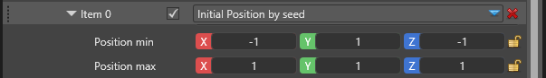
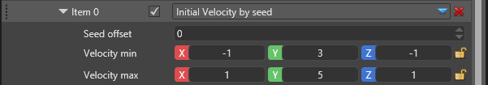
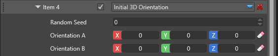

# Particle Initializers

 

The initializers manage the initial values for all particle fields when they first spawn. They have no function on particles which have been spawned on previous frames.

Note! Some updaters act as post-updaters, changing the particle's value at the *end* of the frame. They will effectively overwrite any initial values set by a similar initializer. Such is the case with all animations. They operate on the particle's lifetime and a color animation updater will overwirte any initial values from a color initializer.

Similarly, initializers which operate on the same field are exclusive and only the bottom one will have any effect, since they are executed in order. For example if you assign two color initializer, only the second one will have any effect.

## Common Properties

There are several properties common for many initializers. Depending on the initializer some or all of them may be missing, if they are irrelevant. The common properties are explained below:

 

| Property                    | Description                                                                                             |
|-----------------------------|---------------------------------------------------------------------------------------------------------|
| Debug Draw                  | A debug wireframe shape will be drawn to show the boundaries for this initializer. This feature only works for the editor and is ignored when you run your game.        |
| Position inheritance        | If checked, this module will inherit the particle system component's position, as defined in the Transform field. |
| Position offset             | Additional translation of the module. If it inherits the parent's position, this is applied on top of the inherited one. |
| Rotation inheritance        | If checked, this module will inherit the particle system component's rotation, as defined in the Transform field. |
| Rotation offset             | Additional rotation of the module. If it inherits the parent's rotation, this is applied on top of the inherited one. |
| Scale inheritance           | If checked, this module will inherit the particle system component's uniform scale, as defined in the Transform field. |
| Scale offset                | Additional scaling of the module. If it inherits the parent's scale, this is applied on top of the inherited one. |

For example, a velocity initializer can change its direction depending on the parent's rotation or decide to ignore it and always shoot particles in a fixed direction.

A size initializer on the other hand can't change based on the parent's rotation, so the rotation fields won't appear at all.

## Initial Position

Particles are spawned in an axis-aligned bounding box, defined by its left lower back corner and its right upper front corner.

 

| Property                    | Description                                                                                             |
|-----------------------------|---------------------------------------------------------------------------------------------------------|
| Seed offset                 | This is used for random numbers. Set it to the same value to force the position to be coupled with other other particle fields which have 3 properties (X, Y, Z), like velocity for example. Make them different to force the position to be unique and independant from other fields.               |
| Position min                | Left lower back corner for the box.                                                                     |
| Position max                | Right upper front corner for the box.                                                                   |

 
This image shows the bounding box where particles initially appear for this emitter. In addition to the corners (-1, 0.8, -1) ~ (1, 1, 1), the box is further rotated by 45 degrees as seen from the offset rotation.

 

## Initial Velocity

Particles are spawned with initial velocity which ranges between the defined values. The velocity is independant in all three directions between X, Y and Z.

 

| Property                    | Description                                                                                             |
|-----------------------------|---------------------------------------------------------------------------------------------------------|
| Seed offset                 | This is used for random numbers. Set it to the same value to force the velocity to be coupled with other other particle fields which have 3 properties (x, Y, Z), like position for example. Make them different to force the velocity to be unique and independant from other fields.               |
| Velocity min                | Left lower back corner for the box.                                                                     |
| Velocity max                | Right upper front corner for the box.                                                                   |

## Initial Size

Initial size sets the particle's uniform size when it's spawned for the first time. A size of 1 will result in a 1 meter by 1 meter billboard or quad when rendered.

 

| Property                    | Description                                                                                             |
|-----------------------------|---------------------------------------------------------------------------------------------------------|
| Seed offset                 | This is used for random numbers. Set it to the same value to force the size to be coupled with other particle fields which have 1 property, like color for example. Make them different to force the size to be unique and independant from other fields.                   |
| Random size                 | Shows the minimum and maximum size a particle can have at spawn time.                                   |

## Initial Rotation

Initial rotation sets the particle's angular rotation when facing the camera. Positive values are clockwise rotations. The field only has meaning for camera-facing particles, such as billboards. It has no effect on oriented quads and models.

 

| Property                    | Description                                                                                             |
|-----------------------------|---------------------------------------------------------------------------------------------------------|
| Seed offset                 | This is used for random numbers. Set it to the same value to force the angle to be coupled with other particle fields which have 1 property, like color for example. Make them different to force the angle to be unique and independant from other fields.                  |
| Angle (degrees)             | The minimum and maximum value, in degrees, for the initial rotation.                                    |

## Initial Color

Initial color sets the particle's initial color at spawn time. It goes into the vertex buffer when building the particles and can be used by the material, but might not if the option is not set in the material itself. If setting the color has no effect please refer to the [Material](../particles-reference-materials/index.md) page for further discussion.

 

| Property                    | Description                                                                                             |
|-----------------------------|---------------------------------------------------------------------------------------------------------|
| Seed offset                 | This is used for random numbers. Set it to the same value to force the color to be coupled with other particle fields which have 1 property, like size for example. Make them different to force the color to be unique and independant from other fields.                  |
| Color A                     | The first value, in hexadecimal code. The color will be a random tint between this and the second color.|
| Color B                     | The second value, in hexadecimal code. The color will be a random tint between this and the first color.|

## Initial 3D Orientation

Initial 3D orientation sets the orientation for 3d aware particles when they first spawn. The editable fields use euclidian rotation which is packed into a quaternion orientation by the engine. The interpolated value is on the shortest path  between the two orientations, rather than interpolating each value separately.

 

| Property                    | Description                                                                                             |
|-----------------------------|---------------------------------------------------------------------------------------------------------|
| Seed offset                 | This is used for random numbers. Set it to the same value to force the orientation to be coupled with other particle fields which have 1 property, like size for example. Make them different to force the orientation to be unique and independant from other fields.            |
| Orientation A               | The first oriented position.                                                                            |
| Orientation B               | The second oriented position.                                                                           |

