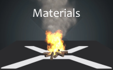
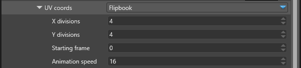
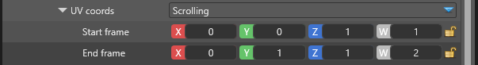

# Particle Materials

 

The particle materials are a simplified version of the [Materials](../../../graphics/materials/index.md) used for meshes. There is only one type of material currently, the Dynamic Emissive material.

## Dynamic Emissive

This material uses a translucent emissive color RGBA for the pixel shading. In HDR rendering mode the values are used as intensity and can be higher than 1.

| Property            | Description                                                                                                     |
|---------------------|-----------------------------------------------------------------------------------------------------------------|
| Alpha-Add           | Translucent rendering supports alpha-blending, additive blending or anything in-between. With this parameter you can control how much alpha-blended (0) or additive (1) the particles should be.         |
| Culling             | There are options for no culling, front face culling and back face culling. Camera-facing particles always have their front face towards the camera.                                         |
| Emissive            | The emissive RGBA color for the particle. Refer to the [Material Colors](../../../graphics/materials/material-colors.md) for a full description.       |
| UV coords           | For particles which use texture sampling uv coordinates animation can be specified. The two currently existing types are specified below.                                                           |

### UV Coords - Flipbook

The flipbook animation considers a texture as a sequence of frames and displays it one frame at a time, like a flipbook.

The picture above is an example of a 4 x 4 flipbook animation texture of an explosion.

The flipbook animation has the following properties:

| Property            | Description                                                                                                     |
|---------------------|-----------------------------------------------------------------------------------------------------------------|
| X divisions         | The number of columns to split the texture into.                                                                |
| Y divisions         | The number of rows to split the texture into.                                                                   |
| Starting frame      | The frame at which to start the animation. The top left frame is 0, increasing to the right before it goes down.|
| Animation speed     | The total number of frames to show over the particle's lifetime. If Speed = X x Y then the animation will show *all* frames over the particle's life. The speed is relative - particles which have longer lifespan will have slower animation.                        |

### UV Coords - Scrolling

The scrolling animation defines a starting rectangle for the billboard or quad, which moves across the texture to its end position. This creates a scrolling or a scaling effect of the texture across the quad's surface.

The texture coordinates can go below 0 or above 1. How is the texture sampled depends on the addressing mode defined in the [Material Colors](../../../graphics/materials/material-colors.md). Refer to the [Texture Addressing Modes](http://tinyurl.com/TextureAddressingModes) for a more detailed information.

The scrolling animation has the following properties:

| Property            | Description                                                                                                     |
|---------------------|-----------------------------------------------------------------------------------------------------------------|
| Start frame         | The initial rectangle for texture sampling when the particle is first spawned.                                  |
| End frame           | The last rectangle for texture sampling when the particle disappears.                                           |

