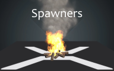

# Particle Spawners

 

Particle spawners control when, how many and at what rate new particles will be emitted in the emitter.

An emitter needs at least one spawner to have any particles at all, but it can also contain more than one spawners with different settings and timings.

## Spawn per second

This spawner emits a fixed number of particles per second while it's active. It balances and interpolates them and it's stable even if the framerate changes or drops. For example at a rate of 20 particles per second the spawner will spawn one particle every three frames for games that run at 60 fps, and two particles for three frames (skipping every third frame) for games that run at 30 fps.

 

| Property                | Description                                                                                            |
|-------------------------|--------------------------------------------------------------------------------------------------------|
| Loop                    | If the spawner should loop when it reaches the end of its duration. By default all spawners loop indefinitely, but can be set to only fire particles once and then stop.   |
| Delay                   | The amount of time (minimum and maximum) the spawner has to delay when the particle system starts before it starts spawning particles.                                                                   |
| Duration                | The duration for which this spawner is actively spawning particles. After this duration it deactivates if the Loop setting is set to One-shot. It enters the Delay phase if the Loop is set to Looping, or it stays active indefinitely if the Loop is set to Looping, no delay.       |
| Particles               | The amount of particles this spawner will try to spawn in the emitter per second. The value can also be a floating value, like 36.875.                       |

## Spawn per frame

This spawner emits a fixed number of particles every frame regardless of the actual framerate. This feature can be useful if you require fixed number of particles, for example exactly one every frame, which is good for trails and ribbons.

 

| Property                | Description                                                                                            |
|-------------------------|--------------------------------------------------------------------------------------------------------|
| Loop                    | If the spawner should loop when it reaches the end of its duration. By default all spawners loop indefinitely, but can be set to only fire particles once and then stop.   |
| Delay                   | The amount of time (minimum and maximum) the spawner has to delay when the particle system starts before it starts spawning particles.                                                                   |
| Duration                | The duration for which this spawner is actively spawning particles. After this duration it deactivates if the Loop setting is set to One-shot. It enters the Delay phase if the Loop is set to Looping, or it stays active indefinitely if the Loop is set to Looping, no delay.                                                                      |
| Particles               | The amount of particles this spawner will try to spawn in the emitter every frame. The value can also be a floating value, including less than 1, in which case a new particle will be spawned every few frames.                                                                              |
| Framerate               | This is purely for estimation purposes only when the engine calculates the maximum number of particles.|

