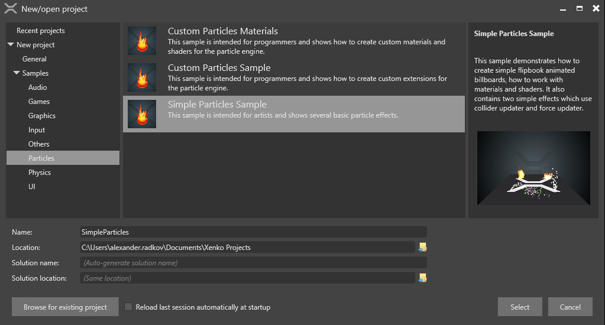
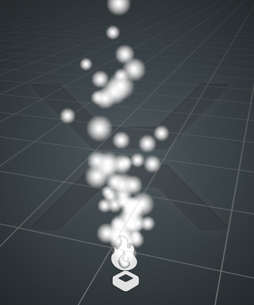
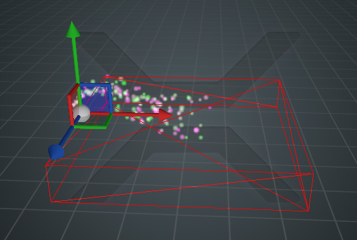
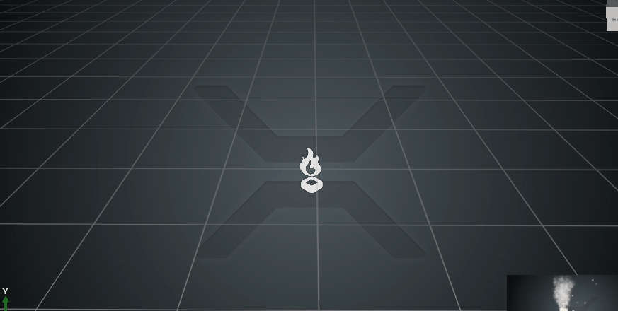

# Simple Particles sample walkthrough

This walkthrough shows how you can create simple particle effects in the game studio.

Please check the [Editing Particles](../../particles-reference/particles-reference-editor/index.md) page if you are not familiar with how to edit the particles.

 

Start by creating a new Simple Particles Sample from the New project menu.

 

There are five particle systems in the project. We will explain briefly what all of them show in order of increasing difficulty.

## Simple Fountain

 

This particle system is almost the same as the pregenerated Smoke Particle System which you can create by right-clicking on the viewport and selecting a new particle system.

In the initializers list add a new Initial Size. We will set the size to vary from 0.05 to 0.1, which is 5cm to 10cm billboards.

In the Material settings find Emissive. There are several options for what to use for emissive color, the default being a texture. Currently no texture is set so the billboards appear as white squares. Click the load icon (a hand with an index finger pointing out) and load a texture. We are using dota.png for the sample, which is a texture of a dot with an alpha channel.

With these three steps you can create the Simple Fountain.

## Colliding Particles

 

### Color

Take the previous particle system, navigate to initializers again and add a Initial Color. Let's choose purple and green so we can easily distinguish them.

You will notice that our particles do not change. This is because the material ignores individual colors for now. Open the material again and instead of texture type choose Binary Operator type for emissive color. Set it to Multiply.

If you expand the Binary Operator you will see it has Left and Right branches. Make one of them texture and select the texture we used before. Make the other one Vertex Stream. The vertex stream uses color vertex stream by default, but you can change it.

You should now see green and purple dots.

### Updaters 

So far our particles are born with initial attributes, but they don't change over time. Let's add some updaters, which will change the particles every frame.

Go to the updaters list and add Gravity. Particles will start to fall. You can check the Initial Velocity field and adjust its strength and orientation to create better looking fountain.

### Colliders

Add another updater to the list and make it a Collider. Colliders define a fixed shape for the particles to collide with. Check the DebugDraw checkbox so that we can see it in the viewport.

Our collider has no shape and nothing is displayed. Change the shape to Cube and you will see it.

You will notice strange particle behavior. Our collider shape is currently on top of where the particles spawn and they are colliding all the time. Let's move it away a little.

In the inheritance field uncheck all values for position, rotation and scale. This will prevent our collider shape from following the particle system and we can fix it to a static position.

The collider is now at the origin. Open the Offset attribute and choose position, rotation and scale for our box. Try making it flat (5, 1, 5) and moving it under the particles. They should collide with it when they reach the surface.

Alternatively you can keep the shape around the particles and uncheck the IsSolid checkbox. This will reverse the surface, making the shape hollow and restricting the particles to stay inside it.

## Big Fire

 

Start by creating a new Smoke Particle System. It doesn't use any textures, so let's change that.

Open the material property and select explosion8x8.png for texture. Move the additive scrollbar to the right.

You will see our texture is not animated and shows all 64 frames in an ugly 8x8 grid. To animate it we will select UV coords and choose Flipbook for our animation method. The default grid is 4x4, which is too coarse for our texture. Let's change it to 8x8 and select 64 frames in Animation Speed. The flipbook should display properly now.

Our effect might not look like fire much at this moment. Try adjusting the Initial Size, Initial Velocity and Initial Rotation to make it more compact and varied.

Try changing the material to adjust the colors. You can easily increase the intensity by making the material use Binary Operator, setting your texture to one node and multiplying it with a fixed Float4 from another node. If you set the values to higher than 1.0 the intensity will also increase.

## Quads

All particle systems we have created so far have been using camera-facing billboards. In the next sample we will use Quads. Quads are flat squares just like the billboards, but rather than facing the camera they are fixed in space, with their own position, scale and 3d orientation.

 

In this sample we have several quads which are standing vertical and are randomly rotated around the Y axis. When viewed from above you can see that they appear flat. This is not ideal if the user can freely rotate the camera, but in most games when the camera is restricted or the effects far away you might want to use quads and prevent them from automatically facing the camera.

### Creating a quad shape

For shape builder choose Quad. You will notice that its default orientation is horizontal. After you apply the flipbook texture of a burning fire it will stay on the ground.

We need to rotate it so that it stands vertical instead. Under Initializers choose Initial 3D Orientation. It uses Euler rotation, but it's saved as quaternion orientation so be aware that any random position between two rotations will be on the shortest arc between the two orientations.

For our case we need to flip it 90 degrees on the X axis. Write -90 in both Min and Max orientations. The fire should be standing now, but it always faces the same direction.

To add some variation, add 180 degrees to Y axis to one of the orientations. Now they'll have a random rotation around their center of 0 - 180 degrees.

## One-time effects

Let's have a look at the Smoke particle system.

 

By now you should know how to use updaters, initializers and materials, so we will skip this explanation.

This effect only plays once, raather than indefinitely like the other particle systems.

 

It only has one spawner and in the Loop settings it is set to One shot. The spawner will only fire once, then halt. It spawns 100 particles per second, but it only lives 0.1 ~ 0.15 seconds, which means it will burst 10-15 smoke particles once.

In fact, most of the effects you need in a game will be like this. All hit effects, button pressing effects or coin collecting effects are similar.

However you will notice that in the editor this effect plays repeatedly. There are a couple of editor-only settings you can use.

 

Reset after X seconds stops the particle system and restarts it every X seconds. The default value is 5, so you can see how other particle systems flicker every 5 seconds or so. For the smoke effect we have set it to 2 so that it loops more often.

Set the timer to 0 to disable any kind of hard resetting.

There are also three buttons for Play, Pause and Stop. Play plays the particle system simulation, Pause freezes it in time (so you can investigate it better or play it again), and Stop halts it completely.

These settings are only applied in the editor and that's why they are in the Editor control category. When you play the effects in your game, they won't hard reset every X seconds.
